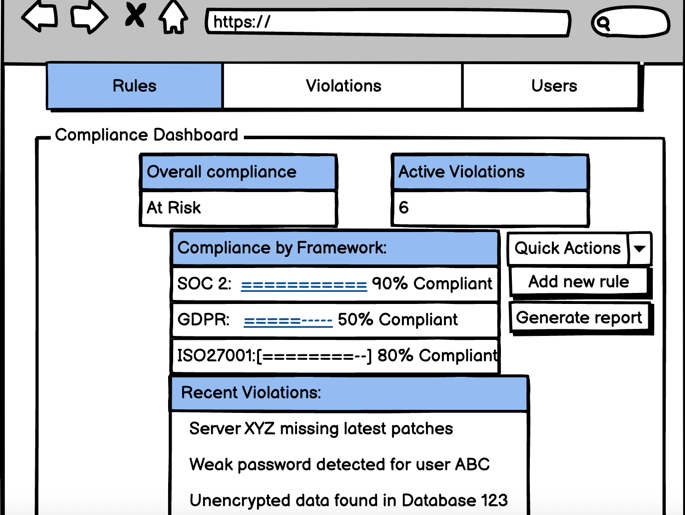
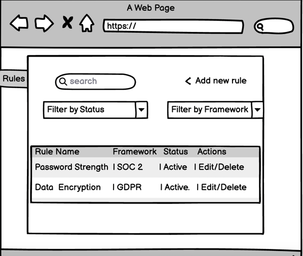
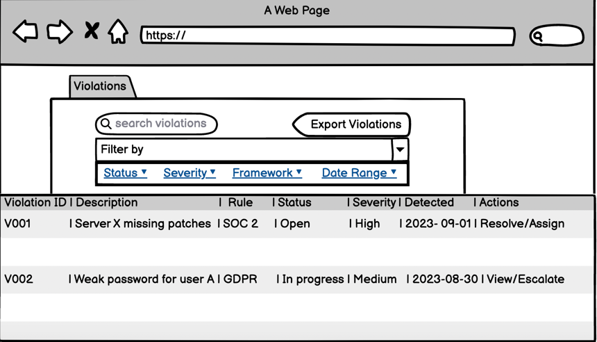

# Automated Compliance Dashboard

## 1. Project Title
**Title**: Automated Compliance Dashboard

***Subtitle***: A Scalable, Real-Time Platform for Managing Regulatory Compliance Across Multiple Frameworks

## 2. Description

### Problem Statement
Organizations need to comply with multiple regulatory frameworks (e.g., SOC 2, ISO 27001, GDPR), which requires constant monitoring, reporting, and risk management. Managing these tasks manually is complex, error-prone, and resource-intensive.

### Solution
The Automated Compliance Dashboard provides a centralized platform to monitor compliance status in real-time, manage compliance rules, generate reports, and receive alerts on potential risks. The solution integrates with cloud services to ensure scalability and reliability.

## 3. Problems to Resolve
- **Data Integration**: Integrating with various data sources to collect compliance-related data in real-time. Compliance data is often scattered across different systems, making it difficult to obtain a comprehensive view of compliance status. The dashboard will integrate with multiple data sources, such as internal logs, third-party APIs, and cloud services, to aggregate compliance data in real-time.
- **Real-Time Monitoring**: Implementing real-time monitoring and alerts for compliance status and potential risks. Traditional compliance checks are typically performed periodically, which can lead to delayed detection of non-compliance issues. This project will implement real-time monitoring using WebSocket and serverless functions to ensure that compliance status is always up-to-date.
- **Report Generation**: Enabling users to generate and download compliance reports for audits. Generating reports for audits is a time-consuming process, often involving manual data collection and formatting. The dashboard will automate report generation, pulling data from integrated sources and formatting it according to regulatory requirements.
- **Security and Access Control**: Ensuring that data is securely stored and accessible only by authorized users. Compliance data is highly sensitive, and unauthorized access could lead to severe consequences. The project will implement robust security measures, including data encryption, role-based access control, and secure API endpoints, to ensure that only authorized users can access or modify compliance data.

## 4. User Stories
- **U1**: As a compliance officer, I want to view a dashboard that displays the compliance status of my organization in real-time so that I can quickly identify and address potential issues.
- **U2**: As a compliance officer, I want to receive real-time alerts when compliance thresholds are breached.
- **U3**: As a compliance officer, I want to add, edit, and delete compliance rules to ensure our systems are aligned with the latest regulations.
- **U4**: As a compliance officer, I want to generate compliance reports for audits.
- **U5**: As a compliance officer, I want to monitor the compliance status of different business units separately to identify and address specific risks.

## 5. Project Scope

### In Scope
- Develop a real-time dashboard that displays compliance status across multiple frameworks.
- Integrate with AWS services (e.g., DynamoDB, S3, Lambda) for data storage and processing.
- Implement a REST API using Spring Boot for managing compliance rules and generating reports.

### Out of Scope
- Advanced analytics features (e.g., predictive risk assessment).
- Integration with external security systems (e.g., firewalls, SIEMs).
- Multi-tenancy features for supporting multiple organizations within the same instance.

## 6. Proposed Architectural Overview
- **Spring Boot**: Core application, handling API requests, rule management, and generating compliance reports.
- **AWS Lambda**: Used for specific tasks like real-time monitoring and alerting.
- **DynamoDB**: Storage for compliance rules and status data.
- **API Gateway**: Exposes the Lambda functions as RESTful endpoints.
- **WebSocket**: Enables real-time updates to the dashboard.

## 7. API
- **GET /api/compliance-status**: Fetches the current compliance status across all frameworks.
- **POST /api/rules**: Adds a new compliance rule.
- **PUT /api/rules/{id}**: Updates an existing compliance rule.
- **DELETE /api/rules/{id}**: Deletes a compliance rule.
- **GET /api/reports**: Generates and downloads a compliance report.

## 8. UML Diagrams
- **Sequence Diagram**: Illustrate how the system processes compliance data, from data ingestion to dashboard updates.
- **Class Diagram**: Show the structure of your Spring Boot application, including models, controllers, and services.

## 9. Tables and Models
- **DynamoDB Tables**:
    - **ComplianceRules**: Stores compliance rules (e.g., threshold levels, actions).
    - **ComplianceStatus**: Stores real-time compliance status data for different business units.
  ### Public Models
#### //ComplianceRulesModel
* String ruleId; // Unique identifier for each compliance rule

* String ruleName; // Name of the compliance rule

* String description; // Description of what the rule checks for

* int threshold; // The threshold value that triggers a compliance action

* String action; // The action to be taken when the rule is breached

* String background;

* ZonedDateTime createdAt; // The date and time when the rule was created.
* ZonedDateTime updatedAt; // The date and time when the rule was last updated

#### //ComplianceViolationModel
- String violationId; // Unique identifier for the violation
- String description; // Description of the compliance violation
- ZonedDateTime detectedAt; // Timestamp when the violation was detected
- String resolutionStatus; // Status of the resolution process (e.g., Open, In Progress, Resolved)
- ZonedDateTime resolvedAt; // Timestamp when the violation was resolved (null if not resolved)
- String businessUnit; // The business unit affected by this violation
- String severity; // Severity level of the violation (e.g., Low, Medium, High, Critical)
- String ruleId; // Reference to the compliance rule that was violated
- String frameworkId; // Reference to the compliance framework this violation relates to
- String assignedTo; // User ID of the person assigned to resolve this violation
- List<String> affectedAssets; // List of assets or systems affected by this violation
- String remediationPlan; // Description of the plan to resolve the violation
- List<String> evidenceLinks; // Links to evidence related to the violation or its resolution

- #### //ComplianceStatusModel
- * String statusId; // Unique identifier for this status entry
- * String framework;  // Name of the compliance framework (e.g., SOC 2, ISO 27001, GDPR)
  * String status;  // Current status of compliance (e.g., Compliant, Non-compliant, At Risk)
  * ZonedDateTime lastUpdated;  // The date and time when the compliance status was last updated
  * List<ComplianceViolationModel> activeViolations; // List of current active violations
  * String businessUnit;  // The specific business unit or department to which this compliance status applies
  * String lastAssessmentId; // Reference to the last compliance assessment performed
  * int riskScore;  // A numerical score representing the level of risk associated with the current compliance status
  * ZonedDateTime nextAssessmentDue; // When the next compliance assessment is due
  
#### // UserModel: (user management, authentication, and authorization.)
 - String userId
 - String username
  -String email
 - String hashedPassword
 - List<String> roles
  - ZonedDateTime lastLogin
  - Boolean isActive

#### //AuditLogModel: (a record of all significant actions within the system, which is a key aspect of compliance and security.)
- String logId
- String actionType
- String userId
- ZonedDateTime timestamp
- String details
- String relatedEntityId
- String ipAddress
- **Data Models**:
    - **ComplianceRule**: Represents a compliance rule (ID, name, threshold, action).
    - **ComplianceStatus**: Represents the current status of compliance (framework, status, last updated).

## 10. Pages

- **Dashboard**: A central page displaying real-time compliance status, risk alerts, and key metrics.
- **Rule Management**: A page for adding, editing, and deleting compliance rules.
- **Reports**: A page for generating and downloading compliance reports.
